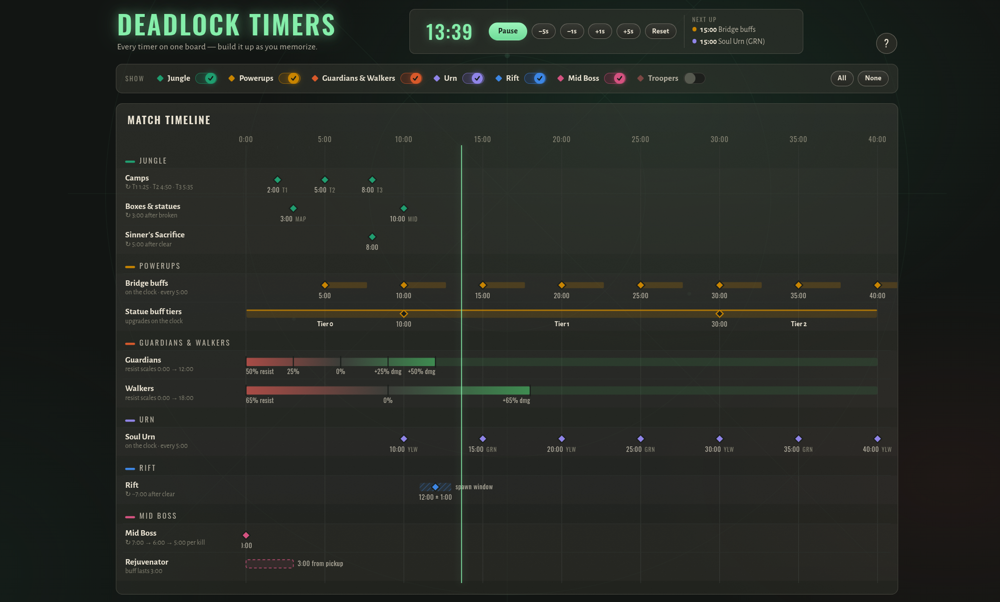
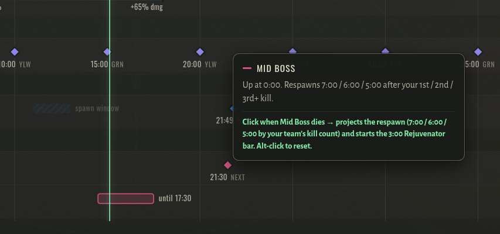
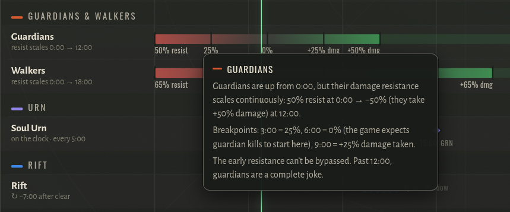

# Deadlock Timers

**Every Deadlock game timer on one glanceable board — built for your second monitor.**


Deadlock has an absurd number of timers — camps, boxes, buffs, resistance windows, urn,
rift, mid boss, trooper cadence — and nobody memorizes them in one sitting. This board
puts all of them on a single interactive timeline styled after the game's own UI, with
**category toggles so you can build it up over time**: start with just Jungle, add
Powerups when the camps feel automatic, and keep layering until you don't need the
board at all.



## Features

- **Swimlane match timeline (0:00–40:00)** — solid diamonds are spawns, hollow diamonds
  are breakpoints, bars show durations and phases, hatching marks the Rift's random
  spawn window, and red→green ramps show exactly when Guardians and Walkers stop
  resisting damage.
- **Category toggles** — seven filters (Jungle, Powerups, Guardians & Walkers, Urn,
  Rift, Mid Boss, Troopers) so the board only shows what you're currently learning.
  Choices persist between visits.
- **Match clock** — hit *Start* at the horn: a NOW line tracks the game, anything
  spawning in the next 45 seconds pulses, and a *Next up* readout lists what's coming.
  Drag the NOW line or nudge with ±1s / ±5s if it drifts.
- **Click-to-project respawns** — click the Rift lane when it dies to see the next
  spawn (+7:00); click Mid Boss to project its respawn (7:00 / 6:00 / 5:00 by kill
  count) *and* start the 3:00 Rejuvenator bar. Alt-click resets.
- **Hour-long game support** — past 30:00 the 40-minute viewport scrolls with the
  match instead of compressing, so late-game projections stay readable. (Stick around
  past 50:00 for a word of encouragement.)
- **Everything readable without hovering** — a reference section below the timeline
  lists every number as plain text, filtered by the same toggles.

| Click a boss lane to project its respawn | Hover anything for the full story |
|:---:|:---:|
|  |  |

## Run locally

No build step — it's a static site.

```sh
npx serve public          # or: python -m http.server 8641 --directory public
```

## Deploy on Railway

The repo is Railway-ready: Nixpacks detects `package.json` and runs `npm start`,
which serves `public/` on `$PORT`.

1. Fork or push this repo to GitHub.
2. In Railway: **New Project → Deploy from GitHub repo** and pick it.
3. Done — no variables or config needed.

## Project layout

```
public/           the site (index.html, styles.css, app.js, data.js)
design/           design-system bundle (brief, tokens, component previews),
                  synced to a Claude Design project
assets/           screenshots used in this README
deathy-transcript.txt   source for all timer numbers
```

All timings live in `public/data.js` as plain data — marks, phase segments,
resistance gradients, spawn windows, and the reference cards. When a patch moves a
number, edit it there and bump `DATA_UPDATED`.

## Sources & credits

Timings from [Deathy's timer guide](https://www.youtube.com/watch?v=YHc-NMmPjHg) and
the [Deadlock Wiki](https://deadlock.wiki). Patches move numbers — trust the game over
this board when they disagree.

Deadlock is a trademark of Valve Corporation. This is an unofficial fan tool, not
affiliated with or endorsed by Valve.
